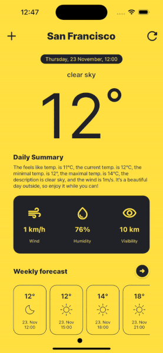

# coding_challenge_weather

## Issues

Weekly forcecast screen is not yet fully developed

Colour generator missing, currently fixed number of colours. This leads to an error message if too many cities are added.

Proper error handling is missing

The app does not work with web, due to known issues with Isar db. For more information check: <https://github.com/isar/isar/issues/1458>

## Dribble template

<https://dribbble.com/shots/20675054-Mobile-Weather-app?utm_source=Clipboard_Shot&utm_campaign=desire-creative_agency&utm_content=Mobile%20%7C%20Weather%20app&utm_medium=Social_Share&utm_source=Clipboard_Shot&utm_campaign=desire-creative_agency&utm_content=Mobile%20%7C%20Weather%20app&utm_medium=Social_Share>

## Required API keys

<https://openweathermap.org/api>

<https://api-ninjas.com/>

<https://platform.openai.com/>
